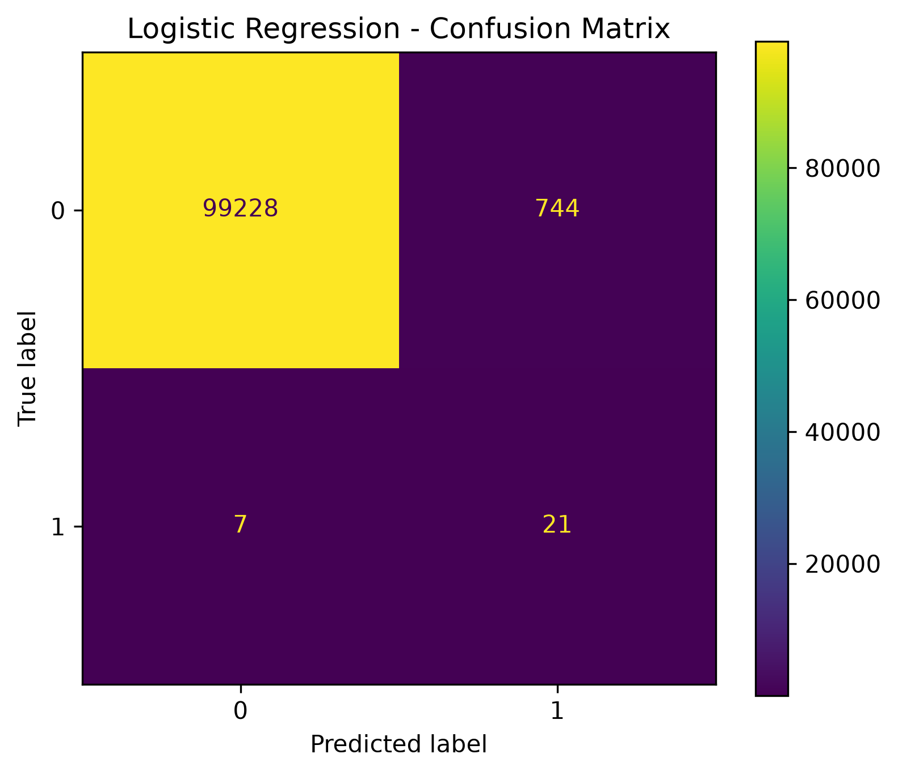
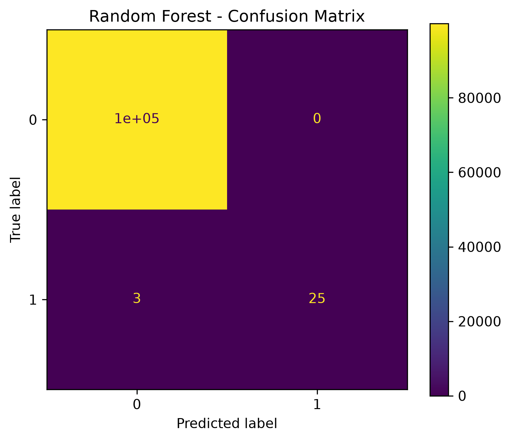

# PS-02: Real-Time Algorithmic Fraud & Anomaly Detection in Streaming Data

A machine learning pipeline to detect fraudulent financial transactions using the PaySim synthetic dataset. Three models — Logistic Regression, Random Forest, and XGBoost — are trained and compared, with results served through a Streamlit dashboard.

## Project Structure

```
├── dataset/
│   ├── raw/                  # original PaySim CSV
│   └── processed/            # cleaned + feature-engineered dataset
├── models/                   # saved model files (.pkl)
├── result/                   # confusion matrix images
├── dashboard/
│   └── app.py                # Streamlit dashboard
├── 01_dataset_inspection.ipynb
└── 02_model_training.ipynb
```

## Dataset

- Source: PaySim synthetic mobile money transaction log
- ~6.36M raw transactions, 500,000 used for training/testing (chronological 80-20 split)
- Fraud is heavily imbalanced: ~0.13% of transactions are fraudulent

## Pipeline

1. **Dataset inspection** — missing values, duplicates, class distribution
2. **Feature engineering** — balance change features, amount-to-balance ratio, one-hot encoded transaction type
3. **Model training** — Logistic Regression (scaled features), Random Forest, XGBoost (with `scale_pos_weight` for imbalance)
4. **Evaluation** — Precision, Recall, F1, PR-AUC, ROC-AUC (accuracy is not a reliable metric here due to class imbalance)

## Results

| Model | Precision | Recall | F1 Score | PR-AUC | ROC-AUC | Accuracy |
|---|---|---|---|---|---|---|
| Logistic Regression | 0.027 | 0.750 | 0.053 | 0.501 | 0.973 | 99.25% |
| Random Forest | 1.000 | 0.893 | 0.943 | 0.930 | 0.980 | 99.997% |
| XGBoost | 0.511 | 0.821 | 0.630 | 0.831 | 0.973 | 99.97% |

**Random Forest** performs best overall, with the highest F1 score and zero false positives on the test set.

### Confusion Matrices

**Logistic Regression**


**Random Forest**


**XGBoost**


## Dashboard

A Streamlit dashboard (`dashboard/app.py`) serves live predictions on the trained XGBoost model, with:
- Fraud probability threshold control
- Fraud/legitimate breakdown metrics
- Highlighted transaction table
- Confusion matrix view

Run it with:

```bash
python -m streamlit run dashboard/app.py
```

## Tech Stack

- Python, pandas, NumPy
- scikit-learn, XGBoost
- Streamlit
- joblib

## Notes

- PaySim is a synthetic dataset with strongly separable fraud patterns, which explains the high accuracy/ROC-AUC scores. Precision, Recall, and F1 were prioritized during evaluation because of the severe class imbalance.
- Model and processed dataset files are excluded from version control (see `.gitignore`) due to size.


## author 
- SHREYA GUPTA | CSE'28 | ASPIRING DATA SCIENTIST |
  
